# clasesDeLCIII

En este repositorio se encontrara la toma de notas y los proyectos desarrollados en las clases de laboratorio de computación III

## Clase 01 - 26/03/2025

### Unidades

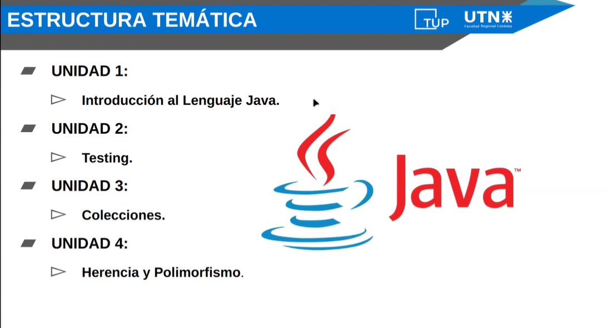

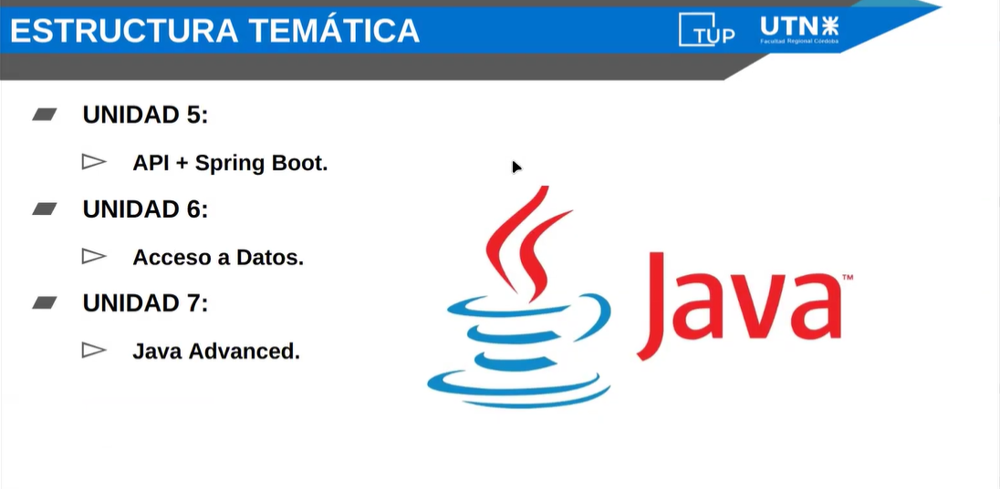

### Anexos

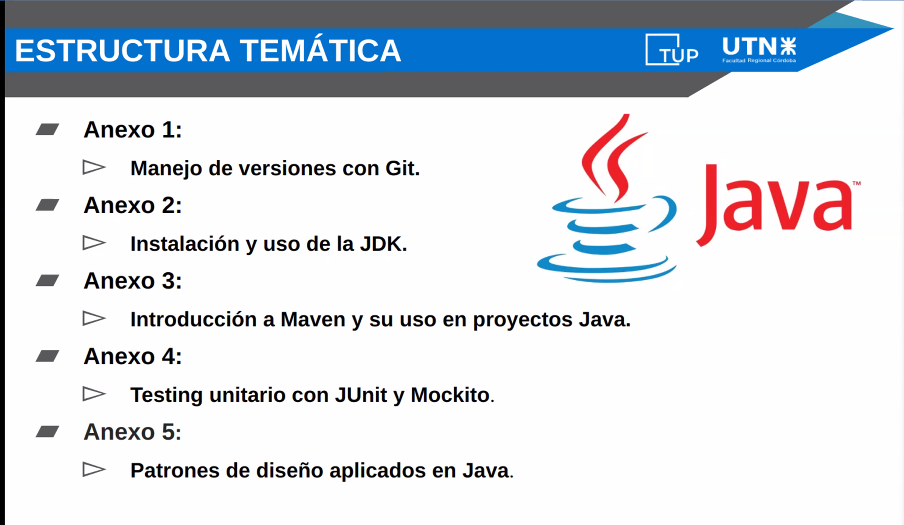

### Fecha de Evaluaciones

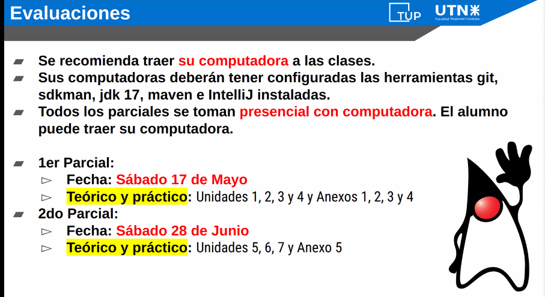
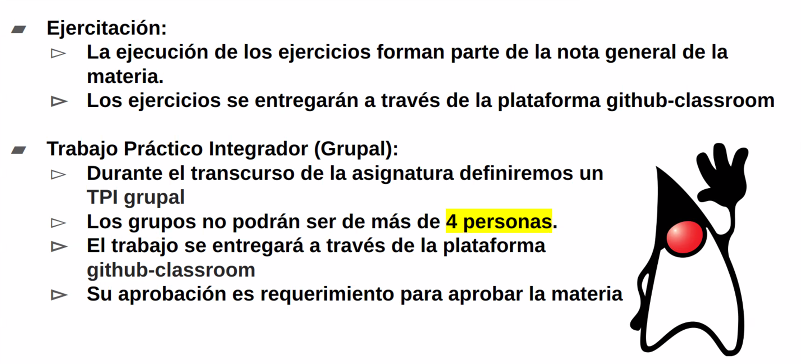

### Estado academico

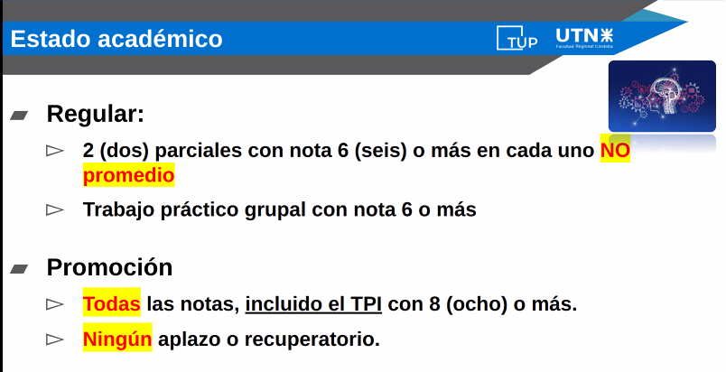

### Unidad 1

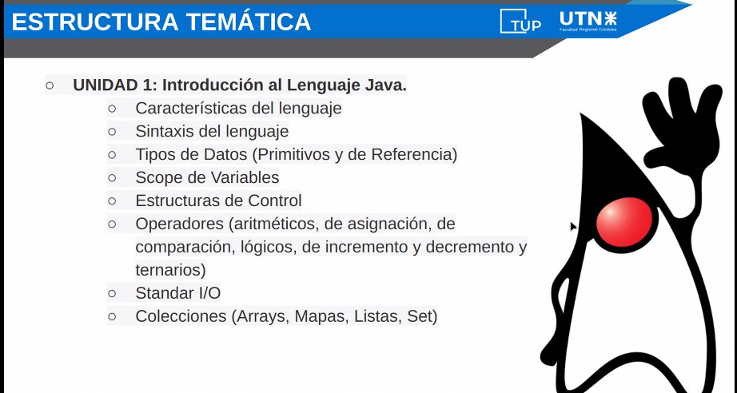

#### Lenguaje Java

- Es un lenguaje de alto nivel, porque trabaja sobre una capa que esta alejada del hardware y es facil de interpretar y entender por las personas.

- Java se dice que es un lenguaje portable, porque tiene un sistema que perimnte que lo que uno desarrolla pueda ser ejecutado en casi cualquier dispotivo (POR QUE CASI, porque ese dispotivo tiene que soportar una JVM), esa JVM es la que interpreta el codigo que hicimos

- Es un lenguaje orientado a objetos, vamos a hacer clases que van a representar objetos del mundo real, que pueden tener propiedades y atributos

#### JDK

- JDK : kit de desarrollo, es una cajiota de herramienta que java nos proporciona para trabajar
  - JDB: depurador que se encarga de ir limpiando el proceso de compilado del codigo, de ejecucion, etc.
  - Biblioteca: Provee librerias donde vamos a tener herraimentas ya codificadas que vamos a poder usar. Por ejemplo la libreria Utils, donde estan las funcionalidades que nos permiten imprimir mensajes por consola.
  - Compilador: Se encarga de convertir nuestro trabajo en algo legible para la maquina.
  - JVM (Java Virtual Machine): Responsable de ejecutar el bytecode que genero el compilador.
  - JConsole: Una consola para tirar comandos, ver las salidas, capturar datos.

#### Sintaxis - Reglas

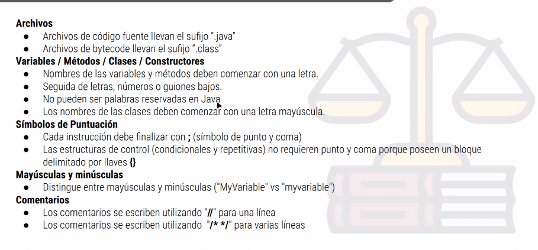
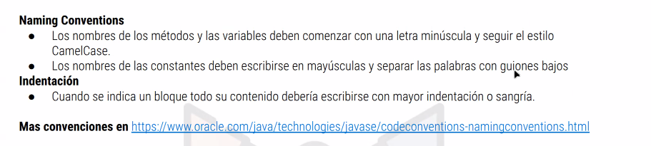

#### Tipos De

##### Primitivos

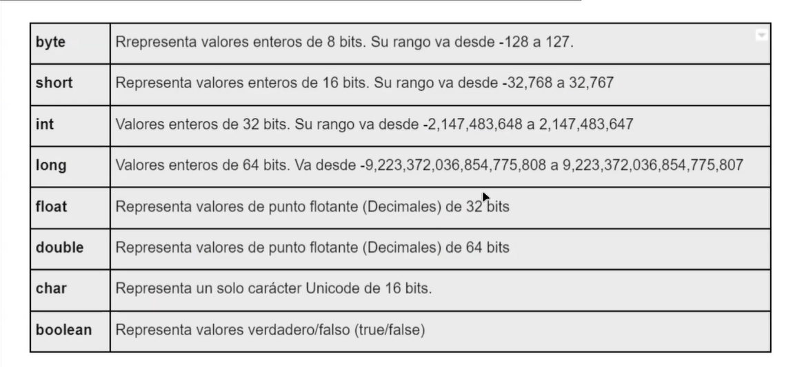

##### Referencia

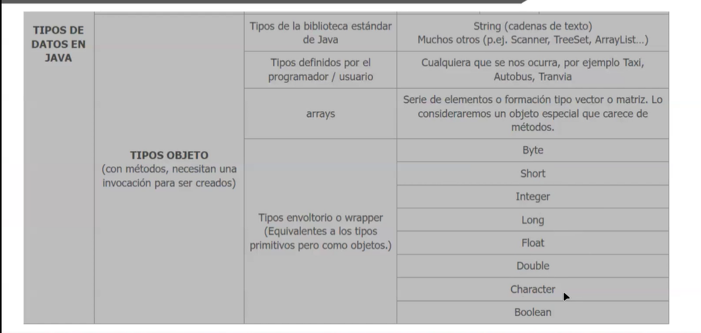

##### String

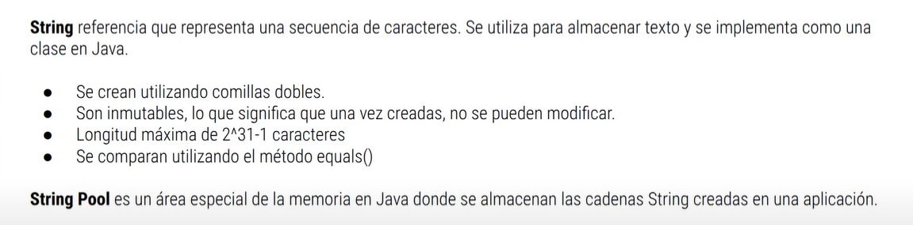

##### Fechas

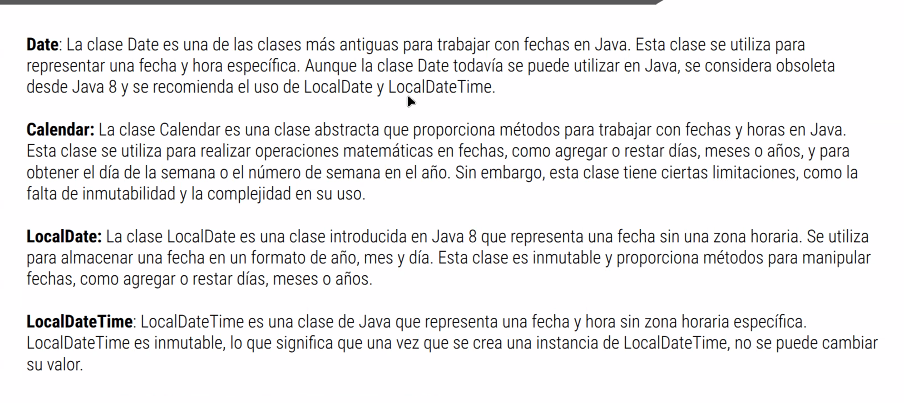

##### Big Numbers

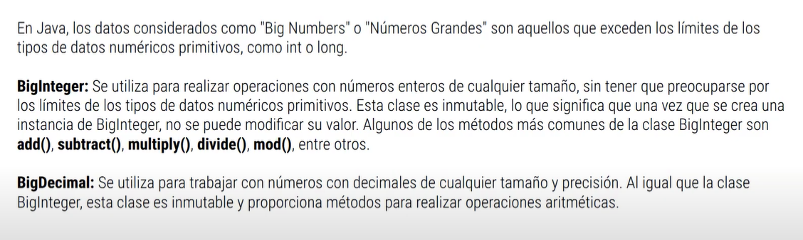

##### Precicion

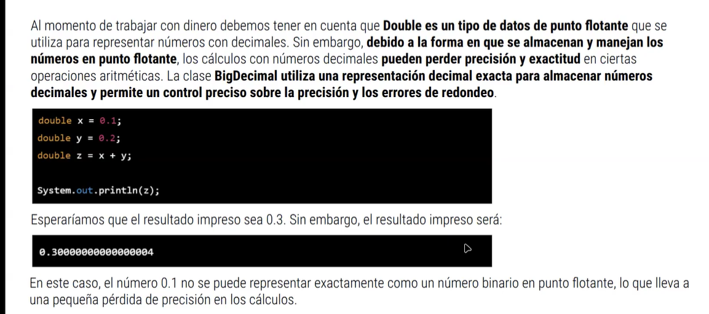

#### Variables

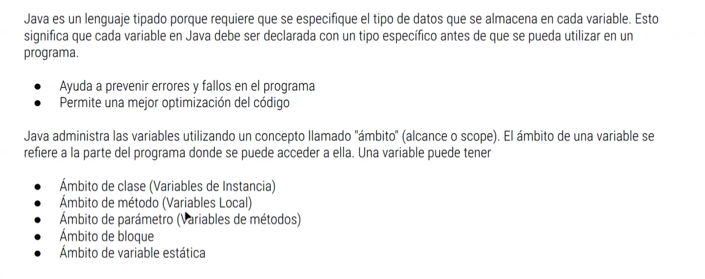

#### Operadores

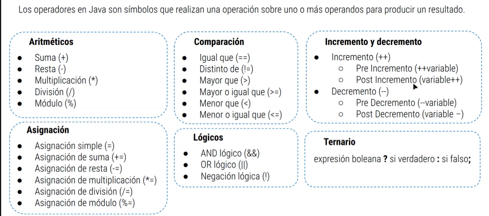

#### Estructuras de control

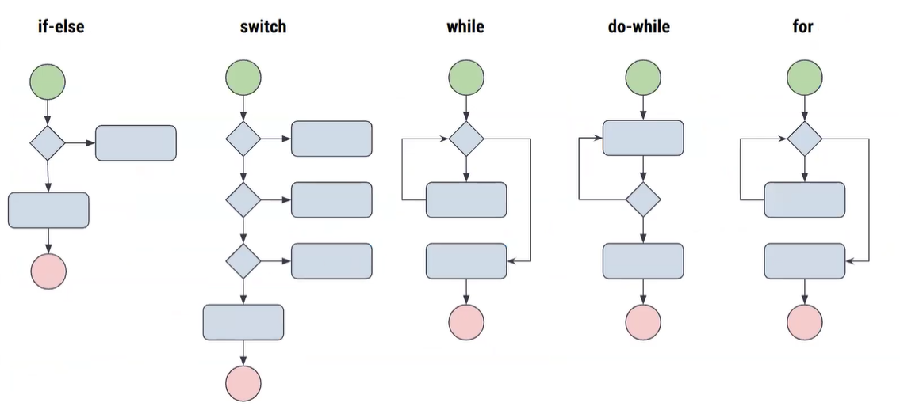

#### Standas I/O

Para que el usuario pueda ingresar datos por consola

Scanner scanner = new Scanner(System.in);
tipoDato variable = scanner.next()

#### Colecciones

Son estructuras de datos que permiten almacenar y manipular conjuntos de elementos de forma eficiente.

#### Arreglos

Es una estructura de datos que almacena una coleccion de elementos del mismo tipo de manera contigua en la memoria
Los arreglos poseen un tamaño estatico

##### Arreglos Unidimensionales

Son aquellos que contienen una sola fila de elementos

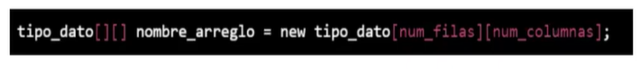

##### Arreglos Multidimensionales

Son aquellos que pueden contener multiples filas y columnas de elementos.

#### java.util - Interface Collection<E>

Una collecion es una estructura de datos que contiene un grupo de elementos (objetos) que pueden ser manipulados mediantes una serie de operaciones.

#### java.util - Interface List<E>

Es una estructura de datos que permite almacenar y manipular elementos en secuencia

#### java.util - Class ArrayList<E>

Se basa en un arreglo subyacente que se redimensiona automaticamente a medida que se agregan o eliminan elementos de la lista.
Automaticamente cuando creamos un array list se crea con 20 espacios

#### java.util - Class Vector<E>

Es similar a la de ArrayList, la diferencia es que Vector es sincronizado, lo que significa que es seguro para hilos de ejecucion concurrentes, lo que evita la posibiladad de condiciones de carrera.

#### java.util - Interface Queue<E>

Una coleccion diseñada para contener elementos antes del procesamiento. Normalmente, pero no necesariamente, ordenan los elementos en una forma FIFO.

#### java.util - Class LinkedList<E>

Esta basado en nodos enlazados. Cada elemento de la lista se almacena en un nodo, y cada nodo tuene un enlace que apunta al siguiente nodo en la lista.

#### java.util - Interface Set<E>

Un conjunto (Set) es una coleccion de elemtos unicos sin un orden especifico.

#### java.util - Interface Map<K,V>

Son una coleccion de elemntos que se almacenan en base a una clave y valor asosiado a dicha clave.

#### java.util - Class HashMap<K,V>

Utiliza una estructura de tabla hash para almacenar pares clave-valor.
Utiliza una funcion de hash para asignar claves a una posicion en la tabla.

#### java.util - Class TreeMap<K,V>

Utiliza un arbol para almacenar los elementos en orden ascendente segun las claves.

#### java.util - Class LinkedHashMap<K,V>

Similar a la implementacion HashMap. La diferencia radica en que LinkedHashMap mantiene un orden de insercion.

#### java.util - Class ConcurrentHashMap<K,V>

Proporciona una estructura de datos en la que se pueden realizar operaciones conccurrrentes en diferentes segmentos de la estructura sin bloqueos
